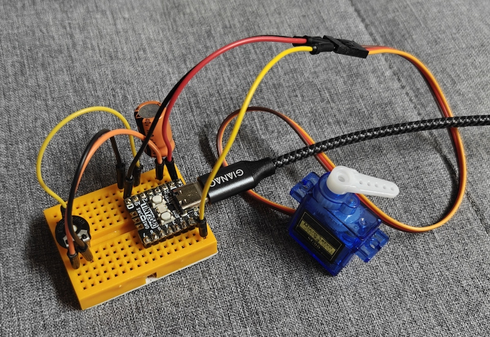

# multi_360_servo-thing #

a simple thing for the "[Modular-Things](https://github.com/modular-things/modular-things)" project that allows you to control up to 8 360° (continuous rotation) RC servos, 4 analog inputs and the built-in RGB LED



> Nota bene: in contrast to the "things" provided by the "Modular Things" project itself, this one has been developed for a [Pimoroni Tiny2040](https://shop.pimoroni.com/products/tiny-2040) board (simply because I just had one on my desk). Since it uses the built-in RGB LEDs of that board, you may have to adjust the LED output commands in the Arduino "Firmware" shown below in order to make a thing for a different board.

## Wiring ##


When powered with 5V, servos may often be directly connected to the RP2040. However, if you plan to use higher voltages (e.g., 6V), you should insert a level shifter between RP2040 and servo.

> Servos should usually be powered by a separate power supply. If you still choose to power them via USB, you should stabilize the power supply of the servos with about 100µF per servo.

## Installation and Usage ##

Below are instructions for installation and use of the "multi_360_servo" thing - skip whatever does not seem applicable:

#### Firmware Preparation ####

1. Install Arduino IDE (see https://www.arduino.cc/en/software)
2. Install the board "**Raspberry Pi Pico/RP2040/RP2350** by Earle F. Philhower, III" using the Arduino "Boards Manager"
3. Install "**osap** by Jake Robert Read" using the Arduino "Library Manager"

#### Firmware Installation ####

1. Create a new sketch and rename it to `multi_servo`
2. Copy the firmware shown below into the sketch editor using the clipboard
3. Connect the RP2040 board via USB and select it from the board dropdown in the Arduino IDE
4. Compile and upload the sketch

#### Software Preparation ####

1. Install Node.js (see https://nodejs.org/en/)
2. Download "modular-things" as a [ZIP archive](https://github.com/modular-things/modular-things/archive/refs/heads/main.zip), unpack it, and move it to a location of your choice
3. Open a terminal window and navigate to the extracted directory
4. run `npm install`

#### Software Installation ####

1. Open the terminal window and navigate to the extracted directory
2. copy the "multi_360_servo" directory from this repository and its contents into the `./things` folder. In the end, `./things/multi_360_servo` should have the following structure:
```
./things/multi_360_servo/
  circuit/
    images/
      layout.png
      schematic.png
      preview.png
  firmware/
    multi_360_servo/
      multi_360_servo.ino
  software/
    multi_360_servo.ts
```
3. Insert the following text into file `./things/_things.json` after the first line (i.e., after the opening bracket):
```json
  {
    "author":  "Andreas Rozek",
    "name":    "multi_360_servo",
    "software":"software/multi_360_servo.ts",
    "firmware":"firmware/multi_360_servo/multi_360_servo.ino",
    "images": [
      { 
        "name": "layout", 
        "src": "circuit/images/layout.png"
      },
      { 
        "name": "schematic", 
        "src": "circuit/images/schematic.png"
      },
      { 
        "name": "preview", 
        "src": "circuit/images/preview.png"
      }
    ]
  },
```
4. Insert the following lines into file `./index.ts`
  * `import multi_360_servo from "./multi_360_servo/software/multi_360_servo";`<br>
    e.g., as the last import statement
  * `multi_360_servo,`<br>
    e.g., as the last line in the `export default {` block
5. (Re)start the server<br>
    `npm run dev`
